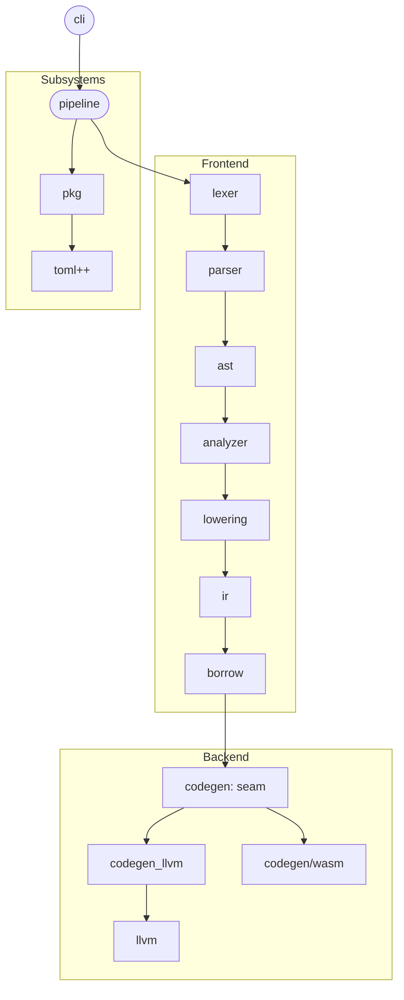

# Architecture

This document describes the intended architecture of the alcy compiler at
MVP: a working compiler that translates alcy source code into executables.
Implementation details may differ while the project is under development;
this document is updated when the design or its architectural contracts
change.

This document covers *what* the compiler is and *why* it is structured this
way. For day-to-day build, test, lint, formatting, and contribution rules,
see [CONTRIBUTING.md](../../CONTRIBUTING.md). Detailed subsystem documentation
belongs in `compiler/docs/`.

## Core design principles

These govern the compiler's implementation. For the principles the
*language* is built to hold - which decide language design questions
rather than code layout - see [principles.md](../../docs/principles.md).

When implementing or modifying any component in alcy, preserve the following
principles:

- **Clear Responsibilities & Module Boundaries**: Each module should have a
  small, well-defined responsibility and a clear dependency direction.
  Split responsibilities when doing so makes boundaries clearer, and avoid
  coupling modules merely for convenience.

- **Explicit Behavior**: Important behavior should be visible at the call
  site. Control flow, ownership, mutation, and non-trivial work should not
  be hidden behind implicit conversions, operator overloading, inheritance,
  callbacks, or other language machinery.

- **Local Reasoning**: Prefer code whose behavior can be understood from its
  surrounding context without tracing framework machinery, hidden state, or
  distant registration. Prefer concrete data and explicit control flow over
  clever abstractions.

- **Predictable Cost**: Allocation, synchronization, I/O, and other
  potentially expensive work should be explicit where practical.
  Abstractions must not introduce runtime costs that are surprising relative
  to their apparent semantics.

- **Zero-Allocation Hot Paths**: The core compilation loop (lexing, parsing,
  IR transformation, and analysis) must avoid heap allocation on hot paths.

- **Pragmatic Simplicity**: Build only what the current design requires.
  Prefer the simplest design that preserves architectural boundaries and
  makes invariants obvious. Do not introduce abstractions solely to avoid
  small amounts of duplication when the abstraction would obscure behavior
  or couple otherwise independent components.

- **Production-Ready Quality**: Core compiler code must maintain explicit
  invariants, deterministic behavior, robust error handling, and tests
  appropriate to the component. Prototype shortcuts must not become
  architectural dependencies.

- **No Runtime Polymorphism**: Compiler code must not use virtual functions,
  virtual inheritance, or RTTI. Prefer concrete types, enums, tagged unions,
  and explicit dispatch where behavior varies by case.

## Overview

alcy is a statically-typed programming language with ownership-based memory
management. The reference compiler is written in C++20 and lowers alcy
source code to LLVM IR, relying on LLVM for optimization and object code
generation.

The MVP scope is a single-threaded batch compiler: given source files, it
produces an executable.

In scope:

- Lexing and parsing.
- AST construction.
- IR construction.
- Name resolution, type checking, and ownership checking.
- A linear single-pass compilation pipeline.
- LLVM IR emission and object-file generation.

Deliberately out of scope for MVP:

- Parallel or incremental compilation.
- Language-server functionality.
- Build-system dependency tracking.
- A direct x86 backend; the direct wasm backend is.

## Architectural shape

Compilation is organized as a linear sequence of stages. Each stage consumes
explicitly owned or borrowed data produced by the previous stage. Stages do
not communicate through shared mutable global state.

The dependency structure should follow the same direction as the pipeline:
higher-level orchestration may depend on lower-level data structures and
utilities, but lower-level modules must not depend on higher-level policy or
orchestration code.

Where behavior varies by case, prefer explicit data-driven dispatch over
runtime polymorphism.

## Repository layout

The repository is the language and the toolchain that compiles it, and the
two are kept apart: what a program is written against lives at the root, and
what implements it lives in `compiler/`.

- `docs/` - the language's own documentation: the specification
  (`docs/spec/`), the decision log (`docs/adr/`), and where the language is
  going (`principles.md`, `roadmap.md`, `backlog.md`).
- `compiler/` - the compiler. One directory per module, each with a
  `BUILD.gn`, which is also the unit the language will call a package once it
  is self-hosted. Its own documentation is in `compiler/docs/`.
  `compiler/fuzz/` holds the fuzz targets, which need libFuzzer and are
  therefore outside `all`.
- `lib/` - the toolchain standard library as source suites
  (`lib/std/<member>/`); embedded into the compiler binary and
  injected as prelude modules, never built as separate packages.
- `e2e/`, `exe/`, `samples/` - the acceptance suites: what the compiler
  accepts, what it compiles into a running program, and the programs kept as
  examples.
- `benchmarks/` - the measurement contract: which cases exist and what a
  number from each means. The engine that runs a phase is in
  `compiler/benchmarks/`.
- `build/` - GN build configuration: toolchains (`build/toolchains/`) and
  compiler flags (`build/config/`).
- `tools/` - the helper scripts: build, run, check, lint, format, package.
  `build.py` and `run.py` drive GN; the `check_*.py` scripts are the
  acceptance suites. They sit beside the sources they drive rather than
  inside `build/`, which holds only what GN itself reads.
- `third_party/` - vendored dependencies as submodules (`llvm`, `fpag`,
  `fmt`, `doctest`, `xxhash`), each wrapped with a `BUILD.gn`.
- `treesitter/` - the language's tree-sitter grammar, a second reading of
  `docs/spec/` for editors. It is not a GN target and shares no build with
  the compiler; `tools/check_treesitter.py` checks it against the
  specification's corpus and against the compiler itself. See
  `docs/adr/0041-alcy-treesitter-grammar.md`.

## Compiler modules

Compilation proceeds as a linear pipeline. There is no shared mutable global
state between stages beyond the data explicitly passed along.

| Module                    | Role                                                                                                                                   | Allocation contract                                                               |
| --------------------------| ---------------------------------------------------------------------------------------------------------------------------------------| --------------------------------------------------------------------------------- |
| `cli`                     | Cli: argument parsing, initialization, and pipeline orchestration.                                                                     | Standard allocation; setup-time work only.                                        |
| `lexer`                   | Tokenizes source files into a token stream.                                                                                            | Zero heap allocations on hot paths; fixed-width, contiguous token slices.         |
| `parser`                  | Builds a typed abstract syntax tree from the token stream.                                                                             | Arena-only for AST node construction.                                             |
| `path`                    | Canonical path value type: native-separator folding, lexical normalization, and joining.                                               | Owned strings; setup-time use only.                                               |
| `ast`                     | Abstract syntax tree node definitions shared by the parser and later stages.                                                           | Arena-allocated nodes; no independent heap allocation outside the arena.          |
| `ir`                      | Core intermediate representation: functions, blocks, instructions, operands, and types, plus storage that owns them.                   | Flat, arena-backed storage.                                                       |
| `analyzer`                | Name resolution and type checking on the AST: module imports, types, and bodies. Ownership is `borrow`'s, over lowered IR.             | No heap allocation on hot paths; operates over immutable views where possible.    |
| `lowering`                | AST-to-IR lowering: a checked package becomes verifier-ready IR storage, reusing the checked type table in place.                      | Borrows the caller's arena, sources, and interner; owns the storage it returns.   |
| `borrow`                  | Ownership checking over lowered IR: use-after-move, borrow exclusivity, assignment to borrowed places, and reference escape.           | No heap allocation; per-block states live in the pass's own frames.               |
| `pipeline`                | Project-level build flow: package discovery, source loading, and per-file stage orchestration. It calls every stage; none calls the next. | Explicit phase boundaries and arena resets.                                       |
| `pkg`                     | Stands for `package`. Package manifests (`alcy.toml`) and the toolchain file: parsed bytes, never a file opened.                            | Arena-backed views; no heap allocation in the model itself.                       |
| `playground`              | The compiler as a host API: `alcy_check`, `alcy_compile`, and `alcy_release` over one source buffer, with the CLI's JSON diagnostics array. | One pipeline context per call; the result owns malloc'd buffers.                  |
| `source`                  | Source file registry: memory-mapped file loading with stable file ids.                                                                 | Mapped files plus small owned tables.                                             |
| `codegen`                 | The backend seam: `Backend`, `EmitRequest`, `Target`, and the dispatch. Implementations live beside it; the pipeline names only the seam. | N/A - dispatch only.                                                             |
| `codegen_llvm`            | Emits LLVM IR from analyzed IR, and the module to an object, textual IR, or bitcode. `Target` says what it builds for.                | Local API buffers only.                                                           |
| `codegen/wasm`            | alcy's own wasm emitter: verified IR in, a final WASI module out, no LLVM or linker behind it. Reached with `--backend=direct-wasm`.    | The module is built in memory, one pass.                                          |
| `diag`                    | Stands for `diagnostic`. Source spans, diagnostics, arena-backed bags, and the fmtlib renderer.                                        | Zero heap allocation on hot paths; message bytes use an injected arena.           |
| `i18n`                    | Stands for `internationalization`. The languages the compiler reports in, and the catalog that holds every message it can print.      | Catalog strings are static; the cli owns the composed copies.                      |
| `text`                    | Text primitives shared across stages: escape decoding for string literals, and JSON reading and writing.                               | Owned strings; cold paths only.                                                   |
| `symbol`                  | Mangling and demangling for linker-visible names, so a source name cannot collide with another package's symbol.                       | Owned name strings; cold paths only.                                              |
| `base`, `debug`, `config` | Low-level shared facilities for numeric types, nesting limits, diagnostics/assertion helpers, and build-time flags.                  | Zero heap allocations.                                                            |

Supporting targets include `tests` and `benchmarks`.

Diagnostic presentation is resolved by the `cli` module from the invocation's
`--color` and `--lang` settings. The `diag` renderer receives explicit rendering
options and never probes the terminal or the environment; the shared `term`
facility owns terminal capability detection and the base ANSI sequences. A
`DiagBag` is constructed with the invocation's language and composes each
message from the `i18n` catalog as it is emitted, so a diagnostic carries the
text the user was told rather than a recipe for telling them. The `pipeline`
module owns diagnostic production and storage, while the `cli` module owns
diagnostic emission.



## Dependency direction

Dependency direction is part of the architecture, not merely a build-system
choice.

Higher-level modules may depend on lower-level modules, but lower-level
modules must not acquire dependencies on higher-level orchestration or policy.
New dependencies should have an architectural reason; convenience imports or
shortcuts are not sufficient justification.

In particular:

- Leaf modules such as `base`, `config`, and `debug` must remain independent of
  compiler pipeline stages.
- Core representations such as `ast` and `ir` must not depend on code
  generation policy.
- `codegen_llvm` depends on compiler IR and LLVM APIs, but the IR must remain
  independent of LLVM.
- Pipeline and cli code coordinate stages rather than embedding their
  implementation details into shared lower-level modules.

Avoid cyclic dependencies between modules.

## Intermediate representation

`compiler/ir` is the central data structure of the compiler. It models programs
as functions containing basic blocks of instructions over typed registers,
with explicit control flow (`Br`, `CondBr`, `Switch`, `Call`, `Ret`) and a
fixed set of opcodes (`compiler/ir/opcode.h`). Ownership-related operations
(`Move`, `Drop`) are part of the instruction set so later analyses can reason
about them uniformly.

The IR is designed around explicit data representation, stable indexing, and
invariant-preserving construction.

Key design points:

- **Interned types**: Every type reference is a `TypeIdx` into a unified type
  table (`TypeNode`: a `TypeTag` plus optional metadata for the composite
  kinds). Primitive tags are pre-interned in tag order; composite types
  (`Struct`, `Enum`, `Array`, `Slice`, and the structural `Ref`/`Tuple`
  shapes) are created through builder factories.

- **Tagged operands**: An `Operand` carries its type reference together with
  its tagged payload so the tag and payload cannot drift apart. Dispatch uses
  the corresponding tag and checked accessors.

- **Structural verification**: `verify_storage()` checks structural
  invariants including index bounds, single-definition of registers,
  terminator placement, and per-opcode operand shapes. It returns
  `base::Result<void, VerificationError>`. The emitter runs verification in debug
  builds before LLVM verification.

- **Invariant-preserving construction**: Important structural invariants
  should be enforced by types, builders, and construction APIs where
  practical, rather than relying solely on comments or post-hoc validation.
  Index ranges must reference consecutive entries. Multi-entry ranges are
  built with `SeqBuilder`, which enforces contiguity; blocks requiring forward
  references use explicit backpatch setters.

The detailed IR construction contract, opcode conventions, and storage layout
are documented in [ir.md](ir.md).

## Memory & lifetime model

The compiler uses explicit ownership and phase-based lifetimes to keep
allocation behavior predictable.

- **Arenas & bump allocators**: AST/IR nodes, symbols, and instruction
  structures are allocated sequentially within fixed-size, chunked bump
  arenas (`core::bump_arena`) rather than by individual `new`/`delete`.
- **Identifier interning**: String literals and symbol names are interned
  during lexing into the compiler's string storage and referenced elsewhere
  through 32-bit `SymbolId` handles.
- **Per-file lifetime resets**: The pipeline clears the underlying bump arena
  at defined phase boundaries between files, eliminating individual node
  deallocation.
- **Explicit ownership**: Ownership and lifetime relationships between
  compiler data structures must remain clear across module boundaries.
  Non-owning views must not outlive the storage they reference.

The allocation model is an architectural contract on hot paths. New
allocating mechanisms in lower-level infrastructure require explicit
consideration of their effect on these contracts.

## Exception and RTTI policy

- The compiler is built with `-fno-exceptions`. Errors and expected
  recoverable failures are reported through `base::Result<T, ErrorCode>`-style
  return values or diagnostics. C++ exceptions are not part of compiler
  control flow.
- The compiler is built with `-fno-rtti`. Runtime polymorphism is not used
  in compiler code: no virtual functions or virtual inheritance. Where
  behavior varies by case, use concrete types, enum dispatch, or tagged
  unions.
- The vendored LLVM fork is itself built without RTTI and without exception
  handling; compiler code interacting with LLVM APIs must not assume either
  facility is available.

## Validation & error model

Validation happens at trust boundaries - the public API of each module -
and nowhere else by default. The contract (decided in
[`docs/adr/0015-boundary-validation.md`](../../docs/adr/0015-boundary-validation.md)) is:

- **Public API is checked-only.** Every public entry point that accepts
  externally supplied or independently constructible data returns
  `base::Result<T, E>`; there is no public unchecked API. Unchecked
  implementations live in private headers or `.cc` files.
- **One rule chooses `E`.** A module-local error type when the caller must
  handle the failure programmatically (`path::PathError`,
  `ir::VerificationError`, ...); `diag::Reported` when details are accumulated in
  a `DiagBag` and only success/failure crosses the boundary. The
  `diag::Fallible` container alias is not used: the error type is spelled
  out in every signature.
- **Verifiers are pure.** `verify_*` functions return
  `base::Result<void, VerificationError>` (or a validated artifact) and never
  mutate input, perform I/O, log, write to a `DiagBag`, or touch global
  state. Public entries convert a verifier failure into a diagnostic and
  return early.
- **Verified artifacts cross hot paths.** Where several consumers need the
  same guarantee, the validating entry returns a proof-carrying type
  (`ir::VerifiedStorage`) so downstream stages do not repeat the full
  verification. Pure `verify_*` checks without a proof type
  (`ast::verify_file`, `lexer::verify_token_stream`,
  `analyzer::verify_module_tree`) run once at the producing or
  consuming boundary. Local index/range invariants remain `DCHECK`s.
- **Responsibilities.** The `cli` parses argv, validates flag values,
  builds `CliConfig`, dispatches, and maps exit codes; it performs no
  semantic validation of source, manifests, module graphs, or IR.
  Pipeline entries validate their raw request once and pass validated
  targets down, so the same check is never implemented twice
  (`docs/adr/0042-the-pipeline-resolves-the-target.md`).

## Pipeline & data flow

```text
Source bytes
   │
   ▼
[ Lexer ]          -> token buffer
   │
   ▼
[ Parser ]         -> AST
   │
   ▼
[ Analyzer ]       -> checked AST
   │
   ▼
[ Lowering ]       -> verified IR
   │
   ▼
[ Borrow ]         -> ownership-checked IR
   │
   ▼
[ codegen ]        -> the backend seam
   │
   ├─▶ [ codegen_llvm ]   -> LLVM IR / object code
   └─▶ [ codegen/wasm ]   -> a final WASI module
```

A stage never calls the one that follows it: `pipeline` calls each in turn,
and passes the output of one to the next as a value. That is what keeps a
stage's dependencies to the ones below it - `analyzer` reads parsed items and
cannot lex, and the thread count and the order diagnostics merge in belong to
`pipeline`, which knows how many files there are, rather than to the stage
that happens to read them.

1. **Lexing** - `lexer` reads a raw source view and produces a flat token
   buffer; tokens store fixed-width source offsets rather than line/column
   strings.

2. **Parsing** - `parser` consumes the token buffer and emits a typed AST
   into the module's arena. IR construction is a later stage.

3. **Semantic analysis** - `analyzer` resolves names and checks types on
   the attributed AST:

   - **Name resolution**: mapping interned `SymbolId`s to declarations.
   - **Type checking**: computing and verifying type signatures.

4. **Lowering** - `lowering` turns the checked package into IR, consuming
   the type information above. Typed high-level desugars (`?`,
   `match` lowering, loop lowering) run here. A separate HIR is revisited
   only if match-lowering complexity, optimization passes, or region
   precision demand it.

5. **Ownership analysis** - `borrow` tracks `Move`/`Drop` instructions
   across the control-flow graph to enforce single-ownership guarantees.
   It is the stage after lowering, not part of the analyzer.

6. **LLVM code generation** - `codegen_llvm` walks verified basic blocks and
   lowers alcy IR operations to LLVM IR. The program runtime — `alcy_alloc`,
   `alcy_dealloc`, `alcy_print`, `alcy_println`, `alcy_panic`, and
   `alcy_sys_write`, over libc — is defined in that same module, so a build
   spawns no compiler for it and it is optimized with the program
   ([`docs/adr/0023-program-runtime-in-process.md`](../../docs/adr/0023-program-runtime-in-process.md)).

Each stage should expose the minimum data needed by the next stage. A stage
must not reach backward into another stage's private state as a shortcut.

A stage's scratch is sized once for the run, and the unit of work clears the
part of it that unit owns. Tables a stage indexes by a global index - by
register, by block, by module - are sized for the whole package, so a table a
function rebuilds or rewalks before looking at its own work makes the cost of
one function grow with the size of the package, which is the shape that turns
a large package from slow into unusable. When a stage needs a per-function
answer to a question about the package, it gathers the answers once and reads
them from a table. The stages that hold such a table say so where they
declare it, and the trace is what says whether it is still being walked.

The frontend's stages are the unit of work for parallelism, one function per
thread, in the order that makes each one independent of the one before it:
[`docs/adr/0046-the-frontend-cost-is-per-function.md`](../../docs/adr/0046-the-frontend-cost-is-per-function.md)
records the measurements that put the stages in that order and the one whose
blocker is a data structure rather than scratch. A target without threads
runs each of those units inline, which is why none of them needs a second
path.

## LLVM integration

The compiler links against a private LLVM fork
(`third_party/llvm`, see [`docs/adr/0002-llvm-fork-prebuilt.md`](../../docs/adr/0002-llvm-fork-prebuilt.md)).
The LLVM dependency is an implementation detail of the active code-generation
backend; compiler IR must remain independent of LLVM-specific types and
policies.

Only the libraries required for IR construction and emission are used. The
fork is consumed as prebuilt static libraries keyed by the submodule tag,
with a from-source fallback. Build and platform details are documented in
[build.md](build.md).

## Verification

Verification is layered by bug class, and no layer substitutes for another. A
compiler can be memory-safe, crash-free, and still lower a program to the wrong
value, so each layer names what it can see. The rationale and the rejected
alternatives are in [`docs/adr/0017-verification-strategy.md`](../../docs/adr/0017-verification-strategy.md); the
contributor-facing rules are in
[CONTRIBUTING.md](../../CONTRIBUTING.md#testing-rules).

| Layer | Oracle | Runs in | Claims |
| --- | --- | --- | --- |
| Unit tests | An explicit expected value | every build | One named input produces the stated result |
| Property tests | A relation between two computations | every build | The relation holds for every input, or names a counterexample |
| Hostile input | The call returns | every build | A generated or random input does not crash or trip a sanitizer |
| Sanitizers | AddressSanitizer | every debug build | No use-after-free, no out-of-bounds access |
| Sanitizers, generated code | AddressSanitizer over alcy's output | `ci.yaml`, on Ubuntu | A wrong code-generation decision is not a memory bug in the program it emitted |
| Fuzzing | Coverage-guided mutation | on demand | No input reaches a state the existing oracles miss |
| Coverage | A recorded baseline | `ci.yaml`, and `check.sh` | Line coverage of `compiler/` did not decrease |

Two of these are in CI and two are not, and the reason is what each one can
discriminate. The sanitizers on alcy's own output and the coverage ratchet
have an answer for every input, so running them on every change is worth its
cost. The fuzzer's answer depends on where its corpus has got to, so a
per-push run would mostly re-verify what it already knows.

CI runs `tools/check.sh` as a job, so the gate a contributor runs is the gate
the server runs; `docs/adr/0040-gates-live-beside-the-builds.md` records which
job each check lives in and why.
`tools/measure_gates.py` times every gate against lint, the largest, and is a
report rather than a gate.

Two properties of this shape matter more than the table:

**A property test routes through an independent implementation where one
exists.** `symbol::mangle` is verified by `symbol::demangle` round-tripping, so
an encoder that lost or conflated a field cannot have it invented back. Where no
second implementation exists, the property is a fixed point or a self-consistency
of the output. A test that re-asserts the implementation it covers cannot fail
and is not written.

**A deterministic generator, not a fuzzer, is the regression test.** The
hostile-input layer is seeded, so a failure is reproducible from the seed and can
be reported as a bug with a command line. libFuzzer is for finding new inputs; a
crash it finds is checked in as a seed plus a unit test, because the artifact alone
is only replayed by a fuzzer.

The recursion budget is part of this design rather than a detail of one pass:
`base::MAX_NESTING` is shared by the parser, the analyzer, and the lowerer
because it is a property of the language, so a program accepted at one limit is
accepted at all of them. The parser and the analyzer both need it and neither
subsumes the other - a long operator chain parses in a loop, so it is shallow to
the parser while building a tree the analyzer then walks.

Tests reach the compiler through in-memory sources
(`pipeline::check_source`, `tests::add_sources`), so a case that has text does not
create a directory. That keeps the suite hermetic and keeps most cases out of the
failure modes a shared temporary directory brings; a real directory is reserved
for testing the filesystem or writing an output artifact.

## System invariants

- **User-input robustness**: Invalid alcy source must result in diagnostics,
  not an assertion, undefined behavior, or process crash. Internal compiler
  invariant violations may fail fast.

- **Deterministic behavior**: Given the same source, target, compiler flags,
  and dependency versions, compilation must not depend on incidental
  nondeterminism such as iteration order, wall-clock time, or mutable
  process-global state.

- **No ambient inputs**: Builds must not depend on per-user machine state:
  environment variables, ambient locale, wall-clock time, or user identity.
  Every such input must be explicit (CLI flags, manifest, or source) so
  that identical inputs reproduce identical results on any machine.
  Diagnostic messages render in English by default; other languages are
  selected only through an explicit `--lang` flag (never ambient
  locale), and each message is identified by its own catalog key rather
  than by the diagnostic code it happens to be reported under, since
  most codes carry more than one wording. Known tension: rendered
  source paths are currently absolute; workspace-relative rendering is
  future work, not a silent exception to this rule.

- **Configuration layering**: each build dimension lives in exactly one
  place. The manifest (`alcy.toml`, versioned and shared) declares what
  is built: targets, dependencies, and package identity. `.alcy/` beside
  it holds how the goal package is built on this machine (today the link
  driver and its arguments in `toolchain.toml`); a dependency's `.alcy/`
  is never read. CLI flags carry invocation-scoped, user-specific
  configuration: presentation (`--color`, `--lang`, verbosity), local
  paths, and parallelism.
  Dimensions affecting outputs through a finite selection (such as the
  debug/release mode) live on the CLI as part of the build identity;
  option spaces are declared in the manifest while selection happens on
  the CLI. No dimension is configured in both places without a
  documented precedence, and environment variables are never a
  behavioral input channel.

- **Deterministic output**: Where the toolchain permits deterministic
  emission, identical inputs and build configuration should produce
  reproducible LLVM IR and object output.

- **No shared mutable pipeline state**: Compilation stages communicate
  through explicit inputs and outputs rather than mutable global state.

- **Explicit phase lifetimes**: Per-file and per-phase state must have clear
  ownership and reset points. A later stage must not rely on accidental
  lifetime extension of earlier stage state.

- **Invariant enforcement**: Structural invariants should be checked at the
  boundary where they become required, rather than relying on downstream
  consumers to recover from invalid state. See *Validation & error model*.

- **No untracked allocation**: New allocating utilities in low-level
  infrastructure must be evaluated against the zero-allocation contracts of
  the hot-path stages.

## Scope beyond MVP

The following do not have a committed MVP design:

- Parallel and incremental compilation.
- Custom memory management beyond the current arena model.
- Completing `codegen/x86`, or replacing LLVM/the system linker with a direct
  backend on both machines.
- Advanced optimizations and whole-program analysis.
- Language features beyond the MVP subset (defined in `docs/spec/`,
  which is normative for language behavior).

These are intentionally left open until the MVP architecture provides a
stable foundation for evaluating them.

## Bootstrap vision

The long-term project goal is to self-host the toolchain: once the MVP
compiler, build system, core/alloc/std libraries, and surrounding tools
(formatter, linter, LSP, setup action) are complete, the entire toolchain
is rewritten in alcy and the C++ implementation retired. The grammar in
`treesitter/` is written in JavaScript because tree-sitter generates its
parser from it, so self-hosting means a grammar for the grammar rather
than a rewrite of this one.

This is outside the MVP architecture. Production code must not depend on
self-hosting assumptions, and the C++ implementation remains authoritative
until a bootstrap is deliberately introduced.
