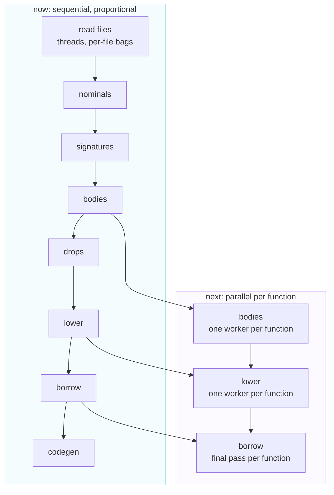

# ADR-0046: The frontend's cost is per function, and the stages that can be are

- Subject: the compiler
- Status: Accepted
- Date: 2026-10-04

## Context

`--time-trace` on a thousand-module package said the frontend was one phase.
`borrow` was 17.6 seconds of a 19.0 second run, and `analyze` was a second
beside it. That reading invited a parallelization plan, and mold's is the
model to reach for: find the unit of work, then run one unit per thread.

Measuring before parallelizing was worth more than parallelizing first. Four
of the five stages were not spending their time on the work they name. They
were spending it on tables whose size is the size of the whole package:

* the borrow checker's scratch is indexed by global register and by global
  block, and a function rebuilt the whole of each before looking at a block
  of its own;
* `type_origin` walked the list of type copies to answer "which type was this
  copied from", and the type checker asks it at the head of every structural
  comparison;
* a nominal lookup walked every type the package declared to answer a
  question about one module;
* lowering asked three questions of nearly every instruction, and answered
  each by walking the whole checked package.

The cost of checking one function therefore grew with the size of the
package, which is the definition of quadratic. A thousand-module package
went from 19.0 seconds to 0.44.

| stage     | before  | after   |
| --------- | ------- | ------- |
| `borrow`  | 17.59 s | 0.09 s  |
| `analyze` | 1.03 s  | 0.09 s  |
| `lower`   | 0.34 s  | 0.18 s  |
| whole run | 19.0 s  | 0.44 s  |

## Decision

A stage's scratch is sized once for the run, and a function clears the part
it owns. That is the whole change, and it is the same in all four cases. Two
of them needed more than that:

* the borrow checker's block-indexed rows are reached by walking the CFG from
  the entry block, not by reading the function's declared block range, so the
  set to clear is the closure of the walk. The walk marks blocks with a stamp
  that changes per call rather than clearing its marks.
* `type_origin` and the nominal lookups answer from tables. The lists they
  replaced are still what is handed to the next stage; the tables are
  answers, not storage.

**The plan for parallelism follows from this.** The stages that remain
sequential are the ones whose unit of work is not yet independent, and the
order they have to be made independent in is the order the tables above
became visible.

The unit of work is a **function**, in every stage that has one, and it is the
right unit for the same reason it is right in mold: a function is what a
person names, so its cost is knowable and its absence from a profile is
meaningful. It is not the largest available unit, and that is deliberate. A
package is one unit of work, and handing it to a thread hands back the
sequential run with extra steps.

Three things stand between the stages and that unit, and they are in
dependency order.

**`bodies` needs its type scratch per worker.** `check_fn` writes the
checker's own function state, which is per-worker by construction, and it
also emits diagnostics and interns types. The diagnostics already have the
shape the answer needs: a `DiagBag` per worker, merged in function order at
the end, which is what the file reader does today. The type interner is the
hard part, because `resolve_type` can build a struct or an enum type from a
literal in the body, and a type index names a slot in one shared table.

**`lower` needs its IR builder per worker, and that does not work.** A
function's IR refers to the types the analyzer interned, by index. Two
workers cannot both append to one type table and both be right, and
per-worker tables would need every index remapped before codegen could read
it. Lowering becomes parallel only behind a remap, or after the analyzer
stops letting a body create types.

**`borrow`'s final pass is the cheapest of the three.** `check_function`
touches one function and reads summaries the fixed point has already
settled. Its per-function scratch is per-worker already, because of the
change above. Its diagnostics are per-worker already, because of the file
reader's change. So the final pass becomes `for_each` over functions with no
new machinery.

The summary fixed point is the part of `borrow` that cannot be handed to
`for_each`. One sweep reads a callee's summary and writes the caller's, so a
sweep in index order propagates a chain in one pass where a parallel sweep
propagates one edge per pass. It becomes parallel by giving each function a
private summary for the sweep and reading a snapshot all workers share, which
converges in more sweeps. That trade is worth measuring before it is worth
building, because it is only worth it when the fixed point runs for many
sweeps at all, and on the packages measured here it runs for one.

**wasm keeps working because nothing here needs a thread.** Each change is a
table and a bound. `base::for_each` already runs its body inline where there
are no threads, so a stage that becomes a `for_each` needs no second code
path for the single-threaded target, and the stages this leaves sequential
stay sequential there.

## Consequences

The frontend's cost is proportional to the package again, so the trace says
something about the work: a stage that grows is a stage with more to do, not
a stage that has more to walk past.

The parallelism is not built yet. What is recorded here is the measurement
that says where the seconds were, the order in which the stages can become
per-function, and the one stage in that order whose blocker is a data
structure rather than scratch.